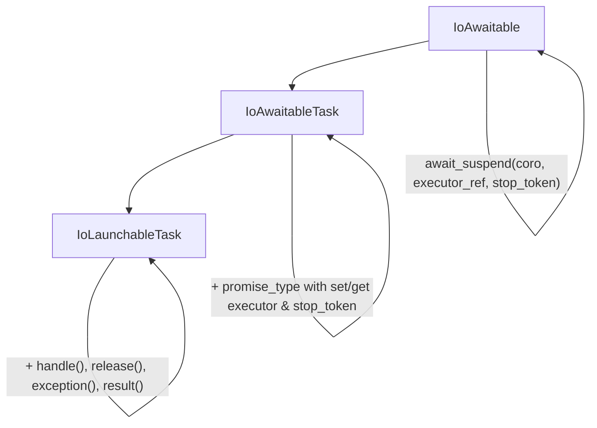

---
Boost.Capy specific instructions
---

# Research:
- research/mazieres-coro.md
- research/ana-lucia-coro.md

## Introduction
- Requirements: Familiarity with C++20 and C++20 coroutines

## Section: Introduction To C++20 Coroutines

### Part I: Foundations

1. **Functions and the Call Stack**
   - How normal function calls work
   - Stack frames and local variables
   - The limitation: run-to-completion

2. **What Is a Coroutine?**
   - Suspendable functions
   - Saving and restoring state
   - Cooperative vs preemptive multitasking

3. **Why Coroutines?**
   - Asynchronous programming without callbacks
   - Generators and lazy sequences
   - State machines made simple

### Part II: C++20 Syntax

4. **The Three Keywords**
   - `co_await` — suspend and wait
   - `co_yield` — produce a value and suspend
   - `co_return` — complete the coroutine

5. **Your First Coroutine**
   - A simple generator example
   - What the compiler transforms
   - The coroutine frame

6. **Awaitables and Awaiters**
   - The awaitable concept
   - `await_ready`, `await_suspend`, `await_resume`
   - `std::suspend_always` and `std::suspend_never`

### Part III: The Coroutine Machinery

7. **The Promise Type**
   - `get_return_object()`
   - `initial_suspend()` and `final_suspend()`
   - `return_void()` / `return_value()` / `yield_value()`
   - `unhandled_exception()`

8. **Coroutine Handle**
   - `std::coroutine_handle
`
   - `resume()`, `destroy()`, `done()`
   - Accessing the promise

9. **Putting It Together**
   - Building a complete `task<T>` type
   - Building a complete `generator<T>` type

### Part IV: Advanced C++20 Topics

10. **Symmetric Transfer**
    - Avoiding stack overflow
    - Tail-call optimization for coroutines
    - Returning `coroutine_handle` from `await_suspend`

11. **Coroutine Allocation**
    - The coroutine frame heap allocation
    - Heap Allocation eLision Optimization (HALO)

12. **Exception Handling**
    - Exceptions in coroutines
    - `unhandled_exception()` behavior

## Section: Introduction to I/O Awaitables

### Concept Hierarchy

### What is IoAwaitable?
- The three-argument `await_suspend` signature
- Forward context propagation vs backward queries
- Reference: `<boost/capy/concept/io_awaitable.hpp>`

### IoAwaitableTask
- Promise-level context storage and retrieval
- The bidirectional capability: receive and propagate
- Reference: `<boost/capy/concept/io_awaitable_task.hpp>`

### IoLaunchableTask
- Interface for launch functions
- Lifetime management: `handle()`, `release()`
- Completion access: `exception()`, `result()`
- Reference: `<boost/capy/concept/io_launchable_task.hpp>`

### The Executor
- The `Executor` concept: `dispatch()` and `post()`
- `executor_ref`: type-erased executor wrapper
- Forward propagation via `await_transform`
- Reference: `<boost/capy/concept/executor.hpp>`, `<boost/capy/ex/executor_ref.hpp>`

### The Stop Token
- Cooperative cancellation with `std::stop_token`
- Downward flow from application to I/O
- OS integration (IOCP, io_uring, etc.)
- Propagation through the coroutine chain

### The Allocator
- The timing constraint: `operator new` before coroutine body
- Thread-local propagation and "the window"
- The `FrameAllocator` concept
- Reference: `<boost/capy/concept/frame_allocator.hpp>`

### Launching Coroutines

#### `run_async`
- Entry point from non-coroutine code
- Two-call syntax and C++17 evaluation order
- Handler overloads for results and exceptions
- Reference: `<boost/capy/ex/run_async.hpp>`

#### `run_on`
- Executor hopping within coroutine code
- Binding a child task to a different executor
- Reference: `<boost/capy/ex/run_on.hpp>`

## Section: Capy Library

1. **The `task<T>` Type**
   - Declaring `task<T>` coroutines
   - Returning values with `co_return`
   - Awaiting other tasks
   - Lazy execution and symmetric transfer

2. **Error Handling with `io_result`**
   - `io_result<T>` and structured bindings
   - Error codes vs exceptions
   - Propagating errors through `co_await`

3. **Buffers**
   - `flat_buffer` and `circular_dynamic_buffer`
   - The DynamicBuffer concept
   - Buffer sequences and buffer views

4. **Stream Concepts**
   - `ReadStream` and `WriteStream`
   - `ReadSource` and `WriteSink`
   - Composed `read()` and `write()` operations

5. **Concurrent Composition**
   - `when_all` for parallel execution
   - Result tuple and void filtering
   - Stop propagation across siblings

6. **Cancellation**
   - Stop tokens and stop sources
   - Cooperative cancellation patterns
   - Cleanup on early exit

7. **Synchronization Primitives**
   - `async_mutex` for mutual exclusion
   - `async_event` for signaling

8. **Executors and Strands**
   - `executor_ref` and `any_executor`
   - `strand` for serialization
   - `thread_pool` and `execution_context`

9. **Frame Allocators**
   - Coroutine frame allocation
   - `frame_allocator` and recycling
   - HALO optimization support
