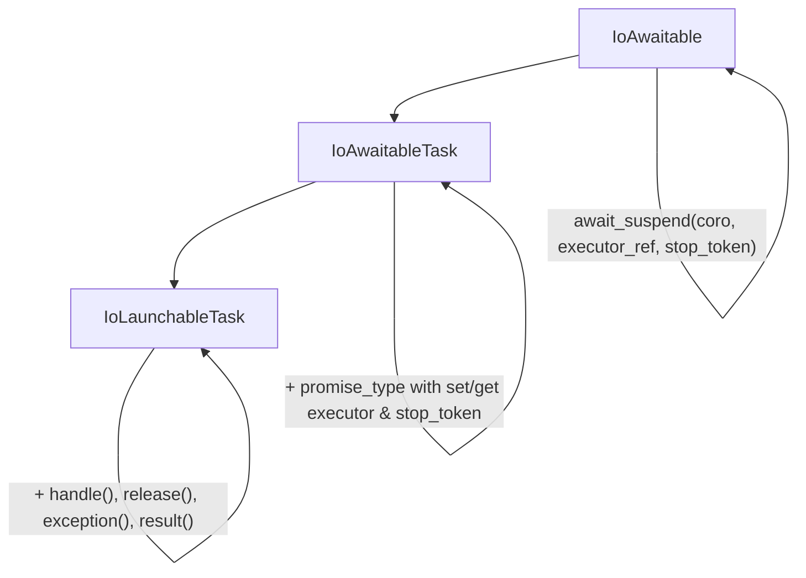

---
Boost.Capy specific instructions
---

# Research:
- research/mazieres-coro.md
- research/ana-lucia-coro.md

# Extra Instructions
- use `thread_pool` and `thread_pool::get_executor` in examples which need a context or executor

## Introduction
- Requirements: Familiarity with C++20 and C++20 coroutines
- Notes: This library offers coroutine concepts and concrete types, buffer concepts and concrete types, stream concepts and concrete types, generic algorithms that work on buffers and streams, plus a thread pool and a strand executor along with a full suite of testing utilities that include mock objects and error generators

## Section: Introduction To C++20 Coroutines

### Part I: Foundations

1. **Functions and the Call Stack**
   - How normal function calls work
   - Stack frames and local variables
   - The limitation: run-to-completion

2. **What Is a Coroutine?**
   - Suspendable functions
   - Saving and restoring state
   - Cooperative vs preemptive multitasking

3. **Why Coroutines?**
   - Asynchronous programming without callbacks
   - Generators and lazy sequences
   - State machines made simple

### Part II: C++20 Syntax

4. **The Three Keywords**
   - `co_await` — suspend and wait
   - `co_yield` — produce a value and suspend
   - `co_return` — complete the coroutine

5. **Your First Coroutine**
   - A simple generator example
   - What the compiler transforms
   - The coroutine frame

6. **Awaitables and Awaiters**
   - The awaitable concept
   - `await_ready`, `await_suspend`, `await_resume`
   - `std::suspend_always` and `std::suspend_never`

### Part III: The Coroutine Machinery

7. **The Promise Type**
   - `get_return_object()`
   - `initial_suspend()` and `final_suspend()`
   - `return_void()` / `return_value()` / `yield_value()`
   - `unhandled_exception()`

8. **Coroutine Handle**
   - `std::coroutine_handle
`
   - `resume()`, `destroy()`, `done()`
   - Accessing the promise

9. **Putting It Together**
   - Building a complete `task<T>` type
   - Building a complete `generator<T>` type

### Part IV: Advanced C++20 Topics

10. **Symmetric Transfer**
    - Avoiding stack overflow
    - Tail-call optimization for coroutines
    - Returning `coroutine_handle` from `await_suspend`

11. **Coroutine Allocation**
    - The coroutine frame heap allocation
    - Heap Allocation eLision Optimization (HALO)

12. **Exception Handling**
    - Exceptions in coroutines
    - `unhandled_exception()` behavior

## Section: Introduction to I/O Awaitables

### Concept Hierarchy

### What is IoAwaitable?
- The three-argument `await_suspend` signature
- Forward context propagation vs backward queries
- Reference: `<boost/capy/concept/io_awaitable.hpp>`

### IoAwaitableTask
- Promise-level context storage and retrieval
- The bidirectional capability: receive and propagate
- Reference: `<boost/capy/concept/io_awaitable_task.hpp>`

### IoLaunchableTask
- Interface for launch functions
- Lifetime management: `handle()`, `release()`
- Completion access: `exception()`, `result()`
- Reference: `<boost/capy/concept/io_launchable_task.hpp>`

### The Executor
- The `Executor` concept: `dispatch()` and `post()`
- `executor_ref`: type-erased executor wrapper
- Forward propagation via `await_transform`
- Reference: `<boost/capy/concept/executor.hpp>`, `<boost/capy/ex/executor_ref.hpp>`

### The Stop Token
- Cooperative cancellation with `std::stop_token`
- Downward flow from application to I/O
- OS integration (IOCP, io_uring, etc.)
- Propagation through the coroutine chain

### The Allocator
- The timing constraint: `operator new` before coroutine body
- Thread-local propagation and "the window"
- The `FrameAllocator` concept
- Reference: `<boost/capy/concept/frame_allocator.hpp>`

### Launching Coroutines

#### `run_async`
- Entry point from non-coroutine code
- Two-call syntax and C++17 evaluation order
- Handler overloads for results and exceptions
- Reference: `<boost/capy/ex/run_async.hpp>`

#### `run_on`
- Executor hopping within coroutine code
- Binding a child task to a different executor
- Reference: `<boost/capy/ex/run_on.hpp>`

## Section: Capy Library

1. **The `task<T>` Type**
   - Declaring `task<T>` coroutines
   - Returning values with `co_return`
   - Awaiting other tasks
   - Lazy execution and symmetric transfer

2. **Error Handling with `io_result`**
   - `io_result<T>` and structured bindings
   - Error codes vs exceptions
   - Propagating errors through `co_await`

3. **Buffers**
   - `flat_dynamic_buffer` and `circular_dynamic_buffer`
   - The DynamicBuffer concept
   - Buffer sequences and buffer views

4. **Stream Concepts**
   - `ReadStream` and `WriteStream`
   - `ReadSource` and `WriteSink`
   - Composed `read()` and `write()` operations

5. **Concurrent Composition**
   - `when_all` for parallel execution
   - Result tuple and void filtering
   - Stop propagation across siblings

6. **Cancellation**
   - Stop tokens and stop sources
   - Cooperative cancellation patterns
   - Cleanup on early exit

7. **Synchronization Primitives**
   - `async_mutex` for mutual exclusion
   - `async_event` for signaling

8. **Executors and Strands**
   - `executor_ref` and `any_executor`
   - `strand` for serialization
   - `thread_pool` and `execution_context`

9. **Frame Allocators**
   - Coroutine frame allocation
   - `frame_allocator` and recycling
   - HALO optimization support

## Section: Buffers

### Part I: Philosophy and Design

1. **Platform-Agnostic I/O Algorithms**
   - Generic `read()`, `write()`, stream algorithms work with any conforming type
   - No dependency on platform I/O (IOCP, io_uring, epoll, kqueue)
   - Algorithms implemented against concepts, not concrete types
   - Same code works with real sockets, SSL streams, mock objects, or custom implementations
   - Enables testing without actual network I/O

2. **Why Buffers?**
   - I/O operations work with contiguous memory regions
   - The fundamental unit: `(pointer, size)` pair
   - OS reads/writes bytes from/to linear addresses

3. **Scatter/Gather I/O**
   - Motivation: avoid copying when data isn't contiguous
   - Real-world examples:
     - HTTP message: headers + body written together
     - WebSocket frame: frame header + payload
   - `readv()`/`writev()` system calls (vectored I/O)
   - Efficiency: fewer syscalls, zero-copy message assembly

### Part II: Buffer Types

4. **const_buffer and mutable_buffer**
   - `const_buffer`: read-only view of contiguous bytes
   - `mutable_buffer`: writable view of contiguous bytes
   - Construction, accessors, prefix removal
   - Reference: `<boost/capy/buffers.hpp>`

5. **Creating Buffers with make_buffer**
   - From pointer + size
   - From C arrays, std::array, std::vector
   - From std::string, std::string_view
   - Reference: `<boost/capy/buffers/make_buffer.hpp>`

### Part III: Buffer Sequences

6. **What is a Buffer Sequence?**
   - Bidirectional range with buffer-convertible value type
   - Single buffers are degenerate sequences
   - Reference: `ConstBufferSequence`, `MutableBufferSequence` concepts

7. **Iterating Buffer Sequences**
   - `begin()` and `end()` for uniform access
   - `consuming_buffers` for incremental consumption
   - Real I/O loop patterns from `read()` and `write()`
   - Reference: `<boost/capy/buffers/consuming_buffers.hpp>`

### Part IV: Buffer Algorithms

8. **Measuring Buffers**
   - `buffer_size`: total bytes across all buffers
   - `buffer_empty`: check if total size is zero
   - `buffer_length`: number of buffers (not bytes)

9. **Copying Buffers**
   - `buffer_copy`: copy between buffer sequences
   - Optional `at_most` parameter
   - Reference: `<boost/capy/buffers/buffer_copy.hpp>`

### Part V: Dynamic Buffers

10. **The Producer/Consumer Model**
    - Dynamic buffers as intermediate storage between producer and consumer
    - Producer: network I/O writes data into the buffer
    - Consumer: application reads and processes the data
    - Synchronization through prepare/commit/consume prevents overflow/underflow

11. **The DynamicBuffer Concept**
    - Producer side: `prepare(n)` -> write data -> `commit(n)`
    - Consumer side: `data()` -> read data -> `consume(n)`
    - Capacity management: `size()`, `max_size()`, `capacity()`
    - Reference: `<boost/capy/concept/dynamic_buffer.hpp>`

12. **DynamicBufferParam for Coroutines**
    - Safe parameter passing rules
    - Lvalue vs rvalue constraints
    - The `is_dynamic_buffer_adapter` tag

13. **Provided Implementations**
    - `flat_dynamic_buffer`: linear, single-buffer sequences
    - `circular_dynamic_buffer`: ring buffer (classic producer/consumer)
    - `vector_dynamic_buffer`: growable, backed by std::vector
    - `string_dynamic_buffer`: backed by std::string

## Section: Streams

### Part I: Stream Concepts

1. **ReadStream**
   - Partial read operations with `read_some(buffers)`
   - Returns `(error_code, size_t)` - may transfer less than requested
   - Reference: `<boost/capy/concept/read_stream.hpp>`

2. **WriteStream**
   - Partial write operations with `write_some(buffers)`
   - Returns `(error_code, size_t)` - may transfer less than requested
   - Reference: `<boost/capy/concept/write_stream.hpp>`

### Part II: Source and Sink Concepts

3. **ReadSource**
   - Complete read operations with `read(buffers)`
   - Fills buffers completely or returns EOF
   - Reference: `<boost/capy/concept/read_source.hpp>`

4. **WriteSink**
   - Complete write with EOF signaling
   - `write(buffers)`, `write(buffers, eof)`, `write_eof()`
   - Reference: `<boost/capy/concept/write_sink.hpp>`

### Part III: Composed Operations

5. **read() Algorithm**
   - `read(stream, buffers)` - loops `read_some` until buffer full
   - `read(source, dynamic_buffer)` - loops until EOF into growable buffer
   - Reference: `<boost/capy/read.hpp>`

6. **write() Algorithm**
   - `write(stream, buffers)` - loops `write_some` until all written
   - Reference: `<boost/capy/write.hpp>`
