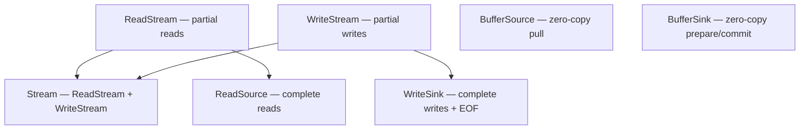
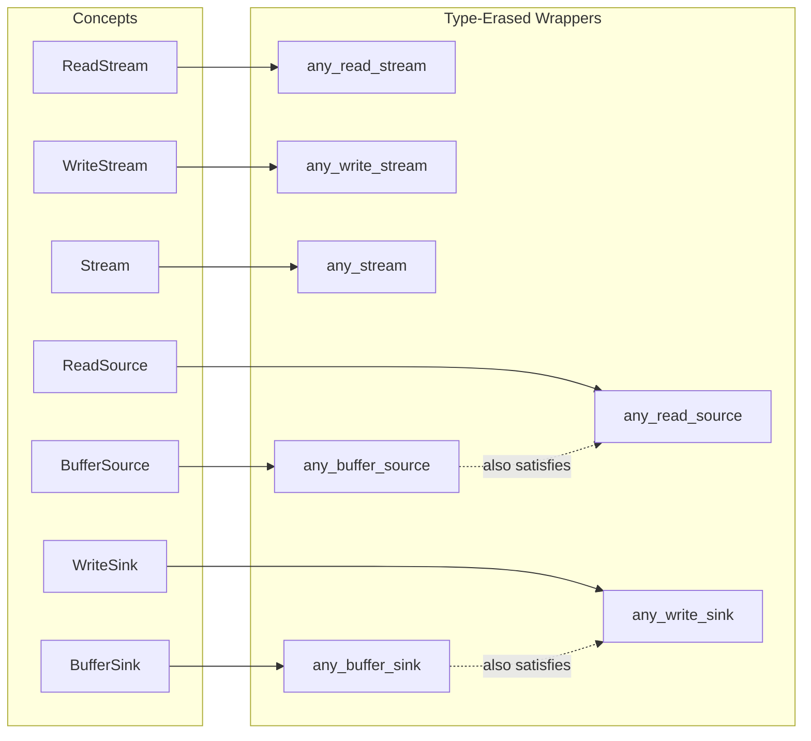

# Capy and Boost.Cobalt: A Comparison

Both libraries use C++20 coroutines for asynchronous programming. The similarity ends there.

Cobalt is a coroutine layer built on Boost.Asio. It adds coroutine syntax — `promise`, `task`, `generator` — on top of Asio's existing I/O infrastructure. Asio is not coroutines-first. It supports callbacks, futures, and coroutines equally. Cobalt inherits this foundation. It can add coroutine types on top, but it cannot change what lies beneath.

Capy is a coroutine-native I/O foundation designed from the ground up. The design started from the ideal use case and worked backward to the implementation. The concept hierarchy, the type-erased wrappers, the allocator model — these fell out naturally from use-case-first design. No compromises.

## The Dimovian Ideal

An I/O library should make the implementation completely invisible. The header exposes the contract. The translation unit contains the machinery. Not a single implementation detail leaks through the public interface.

Capy achieves the Dimovian Ideal. The proof is in `example/asio/`.

### The Header

`api/capy_streams.hpp` is the public interface. It contains zero Asio includes:

```cpp
#include <boost/capy/ex/execution_context.hpp>
#include <boost/capy/ex/executor_ref.hpp>
#include <boost/capy/io/any_stream.hpp>

#include <utility>

namespace boost { namespace asio { class io_context; } }

class asio_context : public capy::execution_context
{
    struct impl;
    impl* impl_;

public:
    using executor_type = capy::executor_ref;

    asio_context();
    ~asio_context();

    net::io_context& context() noexcept;
    executor_type get_executor() noexcept;
    void run();
};

std::pair<capy::any_stream, capy::any_stream>
make_stream_pair(asio_context& ctx);
```

Asio appears only as a forward declaration. The context uses pimpl. The factory returns `capy::any_stream` — a type-erased stream that hides the concrete socket type entirely.

### The Translation Unit

`api/capy_streams.cpp` is where every Asio header lives. The concrete `asio_socket` wraps `tcp::socket`. The concrete `asio_executor` wraps `io_context::executor_type`. All of it is invisible to consumers of the header.

### The Algorithm Code

`any_stream.cpp` is the payoff. It includes `api/capy_streams.hpp` and Capy headers. No Asio headers. None.

```cpp
capy::task<>
writer(capy::any_stream& stream, std::size_t total)
{
    char buf[128];
    std::memset(buf, 'X', sizeof(buf));

    std::size_t written = 0;
    while(written < total)
    {
        std::size_t chunk = (std::min)(sizeof(buf), total - written);
        auto [ec, n] = co_await stream.write_some(
            capy::make_buffer(buf, chunk));
        if(ec)
            co_return;
        written += n;
    }
}

capy::task<>
reader(capy::any_stream& stream, std::size_t total)
{
    char buf[128];

    std::size_t read_total = 0;
    while(read_total < total)
    {
        auto [ec, n] = co_await stream.read_some(
            capy::make_buffer(buf));
        if(ec)
            co_return;
        read_total += n;
    }
}
```

`writer()` and `reader()` operate on `capy::any_stream&`. They don't know what I/O backend produced the stream. They never need to know.

### What Cobalt Does Instead

Cobalt's `cobalt::io` namespace provides wrappers around Asio I/O objects. These wrappers expose concrete Asio types through their interfaces. A `cobalt::io::steady_timer` is an `asio::basic_waitable_timer`. A `cobalt::io::socket` is an `asio::basic_stream_socket`. The implementation is not hidden. It is renamed.

Consumers of Cobalt I/O objects must include Asio headers. The backend leaks through the public interface.

### Relink Without Recompile

A library written against Capy's type-erased streams can be relinked against entirely different stream implementations. TCP today. QUIC tomorrow. A test mock in CI. The polymorphism is the same as what templated Asio code achieves — except the library does not need a recompile. The binary is the interface. Drop in a new `.so` or `.dll` that implements the stream contract, relink, and behavior changes.

Templates cannot do this. Cobalt cannot do this.

| Aspect | Capy | Cobalt |
|--------|------|--------|
| Backend includes in header | None (forward declaration only) | Required |
| Implementation hiding | Pimpl + type-erased returns | Concrete Asio types exposed |
| Algorithm code depends on backend | No | Yes |
| Relink without recompile | Yes | No |
| ABI stability across implementations | Yes | No |

## Stream Concepts

Capy defines seven coroutine-only stream concepts. Cobalt defines none.

Cobalt wraps Asio I/O objects in the `cobalt::io` namespace for faster compilation. These are convenience wrappers, not abstractions. There are no stream concepts, no formal interface contracts, no refinement hierarchy.

Capy's concepts form a refinement hierarchy that emerged naturally from use-case-first design:



`BufferSource` and `BufferSink` implement callee-owns-buffers I/O. The source provides buffers; the caller processes them in place. No copies. Memory-mapped files, hardware DMA buffers, and kernel-provided memory all work naturally through this pattern.

| Concept | Capy | Cobalt |
|---------|------|--------|
| `ReadStream` | Yes | |
| `WriteStream` | Yes | |
| `Stream` | Yes | |
| `ReadSource` | Yes | |
| `WriteSink` | Yes | |
| `BufferSource` | Yes | |
| `BufferSink` | Yes | |

## Type-Erased Streams

Every stream concept in Capy has a corresponding type-erased wrapper. Cobalt does not define stream abstractions, so type erasure at this level is not applicable.

One virtual call per I/O operation. That's the cost. In return: ABI stability, single-compilation functions, and natural binary boundaries.

The wrappers compose. `any_buffer_source` also satisfies `ReadSource` — natively if the wrapped type supports both, synthesized otherwise. `any_buffer_sink` also satisfies `WriteSink`. You pick the abstraction level you need.



This is how the Dimovian Ideal is mechanically achieved.

| Type-Erased Wrapper | Capy | Cobalt |
|---------------------|------|--------|
| `any_read_stream` | Yes | |
| `any_write_stream` | Yes | |
| `any_stream` | Yes | |
| `any_read_source` | Yes | |
| `any_write_sink` | Yes | |
| `any_buffer_source` | Yes | |
| `any_buffer_sink` | Yes | |

## Mock Streams and Testability

When algorithms operate on type-erased interfaces, testing becomes deterministic. Capy provides mock implementations for every stream concept. Cobalt has no stream concepts and therefore no mock streams.

Capy's mock types:

- `test::read_stream`, `test::write_stream` — partial I/O mocks
- `test::stream` — connected pair for bidirectional testing
- `test::read_source`, `test::write_sink` — complete I/O mocks
- `test::buffer_source`, `test::buffer_sink` — zero-copy mocks

`test::fuse` injects errors systematically at every I/O operation point. `test::run_blocking` executes coroutines synchronously for deterministic unit tests. `max_read_size` and `max_write_size` simulate chunked delivery. `expect()` validates written data.

No sockets. No network. No flaky tests.

| Testing Feature | Capy | Cobalt |
|-----------------|------|--------|
| `test::read_stream` | Yes | |
| `test::write_stream` | Yes | |
| `test::stream` (connected pair) | Yes | |
| `test::read_source` | Yes | |
| `test::write_sink` | Yes | |
| `test::buffer_source` | Yes | |
| `test::buffer_sink` | Yes | |
| Error injection (`fuse`) | Yes | |
| Synchronous execution (`run_blocking`) | Yes | |
| Chunked delivery simulation | Yes | |
| Data validation (`expect`) | Yes | |

## Threading Model

Cobalt is single-threaded by design. One executor per thread. Thread-local state. Channels are thread-local only. Primitives cannot be shared between threads.

Capy supports multi-threaded execution. `thread_pool` distributes work across threads. `strand` serializes execution without blocking OS threads. The `Executor` concept is open — implement your own.

| Threading | Capy | Cobalt |
|-----------|------|--------|
| Multi-threaded execution | `thread_pool` | No |
| Serialized execution | `strand` | Single-threaded only |
| Executor model | Concept-based (open) | Thread-local (closed) |
| Cross-thread channels | Yes | No |
| Primitives shareable across threads | Yes | No |

## Context Propagation

Cobalt stores executor context in thread-local variables. Coroutines access it via `this_coro::executor`. This works on a single thread with a single executor. It breaks down when strands or multiple executors enter the picture.

Capy uses the IoAwaitable protocol. When you `co_await`, the caller passes its executor and stop token to the child structurally:

```cpp
auto await_suspend(coro h, executor_ref ex, std::stop_token token);
```

No thread-local state. No ambient context. The executor and stop token flow forward through the call chain as parameters.

| Context Propagation | Capy | Cobalt |
|---------------------|------|--------|
| Mechanism | `await_suspend(h, ex, token)` | Thread-local variables |
| Works with strands | Yes | No |
| Works with multiple executors | Yes | No |
| Stop token delivery | Structural (parameter) | `this_coro::cancellation_state` |

## Cancellation

Capy propagates `std::stop_token` automatically through coroutine chains. Cancel at the top of your coroutine tree, and every nested operation receives the signal. Pending I/O operations cancel at the OS level — `CancelIoEx` on Windows, `IORING_OP_ASYNC_CANCEL` on Linux.

Cobalt uses Asio's `cancellation_signal`. Propagation is manual via `this_coro::cancellation_state`. No OS-level cancellation of pending operations.

| Cancellation | Capy | Cobalt |
|--------------|------|--------|
| Token type | `std::stop_token` | `asio::cancellation_signal` |
| Automatic propagation | Yes | No (manual) |
| OS-level cancellation | `CancelIoEx`, `IORING_OP_ASYNC_CANCEL` | No |

## Buffer Sequences

Capy adopts Asio's buffer sequence model — `ConstBufferSequence`, `MutableBufferSequence` — because it works. Then extends it.

Cobalt uses Asio's buffer types directly and inherits the `DynamicBuffer_v1`/`DynamicBuffer_v2` split.

Capy has one `DynamicBuffer` concept. Coroutines eliminate the ownership ambiguity that created the v1/v2 split in the first place.

| Buffer Feature | Capy | Cobalt |
|----------------|------|--------|
| `ConstBufferSequence` | Yes | Via Asio |
| `MutableBufferSequence` | Yes | Via Asio |
| `DynamicBuffer` | Unified | Asio's v1/v2 split |
| `flat_dynamic_buffer` | Yes | |
| `circular_dynamic_buffer` | Yes | |
| `buffer_pair` | Yes | |
| `slice` | Yes | |
| `front` | Yes | |
| `consuming_buffers` | Yes | |
| `buffer_array` | Yes | |
| Byte-level trimming | Yes | |

## Allocator Control

Cobalt sets up a thread-local PMR resource via `main` or `thread`. All coroutines on that thread share it. The SBO buffer defaults to 4096 bytes.

Capy uses forward-flow allocation. `run_async(executor, allocator)(my_task())` sets the allocator before the task is created. The task's `operator new` reads it from thread-local storage. Per-connection arenas, bounded pools, tracking allocators — all work naturally.

`recycling_memory_resource` provides zero-overhead recycling after warmup. Memory isolated per connection. Reclaimed instantly on disconnect.

| Allocator Control | Capy | Cobalt |
|-------------------|------|--------|
| Granularity | Per-task | Per-thread |
| Allocation model | Forward-flow | Thread-local PMR |
| Per-connection arenas | Yes | No |
| Recycling allocator | `recycling_memory_resource` | |
| Custom allocator support | `run_async(ex, alloc)` | Global setup only |
| Deterministic freeing | Yes | Non-deterministic on MSVC |

## Execution/Platform Separation

Cobalt is coupled to Asio's `io_context`. The execution model and the platform abstractions are one thing.

Capy separates them. The execution model — executors, cancellation, allocation — lives in Capy. Platform abstractions — sockets, `io_uring`, IOCP — live in Corosio. You can test Capy's execution model without a network stack. You can swap the I/O backend without changing your application code.

| Architecture | Capy | Cobalt |
|--------------|------|--------|
| Execution model | Capy (independent) | Coupled to `io_context` |
| Platform abstractions | Corosio (separate library) | Asio (same dependency) |
| Testable without I/O backend | Yes | No |
| Swappable backends | Yes | No |

## Summary

| Feature | Capy | Cobalt |
|---------|------|--------|
| Design methodology | Use-case-first, coroutines-only | Coroutine layer on hybrid Asio |
| Implementation hiding | Dimovian Ideal achieved | Backend types exposed |
| Stream concepts | 7 (refinement hierarchy) | None |
| Type-erased streams | 7 wrappers | None |
| Mock streams | 7 mock types + `fuse` | None |
| Threading | Multi-threaded (`thread_pool`, `strand`) | Single-threaded |
| Context propagation | Structural (`await_suspend` parameters) | Thread-local |
| Cancellation | Automatic, OS-level | Manual |
| Buffer sequences | Extended, unified `DynamicBuffer` | Asio's (v1/v2 split) |
| Allocator control | Per-task, forward-flow | Per-thread, global setup |
| Execution/platform | Separated | Coupled |
| Relink without recompile | Yes | No |
